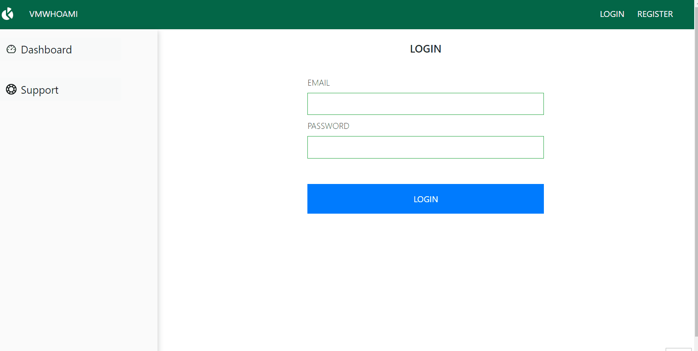

## Qoobus React Test

### Requirements

Task for React

#### Init project (React with typescript, or javascript)

#### Register page (Keep them in the redux)

- Email
- Password
- Repeat password
- First name
- Last name
  (Validation for every field)

#### Login page (If it is logged to be kept in redux,If logged redirect to homepage,verify email and password,check if the email with the password matches the ones from the registration)

- Email
- Password

#### Home page

- Chart example
- Animation example

#### Logout

### Screenshot




### Live Demo

Open [this link](https://qoobus-test.netlify.app/) to view it live.

## Getting Started

To get a local copy up and running follow these simple example steps.

### Prerequisites

Make sure Node.js is running on your local machine

### Setup

```bash
$ git clone https://github.com/vmwhoami/qoobus_test
$ cd qoobus_test
```

Install modules:

```
npm install
```

Run the App:

```
npm start
```

## Available Scripts

In the project directory, you can run:

### `npm start`

Runs the app in the development mode.\
Open [http://localhost:3000](http://localhost:3000) to view it in the browser.

The page will reload if you make edits.\
You will also see any lint errors in the console.

### `npm test`

Launches the test runner in the interactive watch mode.\
See the section about [running tests](https://facebook.github.io/create-react-app/docs/running-tests) for more information.

### `npm run build`

Builds the app for production to the `build` folder.\
It correctly bundles React in production mode and optimizes the build for the best performance.

The build is minified and the filenames include the hashes.\
Your app is ready to be deployed!

See the section about [deployment](https://facebook.github.io/create-react-app/docs/deployment) for more information.

### Deployment

```bash
    git add .
    git commit -m "ready for the first push to Heroku"
    Heroku create $APP-NAME --buildpack mars/create-react-app
    git push Heroku $BRANCH_NAME: master
```

## Author

**Vitalie Melnic**

- Github: [@vmwhoami](https://github.com/vmwhoami/)
- Twitter: [@vmwhoami](https://twitter.com/vmwhoami)
- Linkedin: [vitalie-melnic](https://www.linkedin.com/in/vitalie-melnic/)

## License

Distributed under the MIT License. See `LICENSE` for more information.

## 🤝 Contributing

Contributions, issues and feature requests are welcome!

Feel free to check the [issues page](https://github.com/vmwhoami/qoobus_test/issues).

## Show your support

Give a ⭐️ if you like this project!
