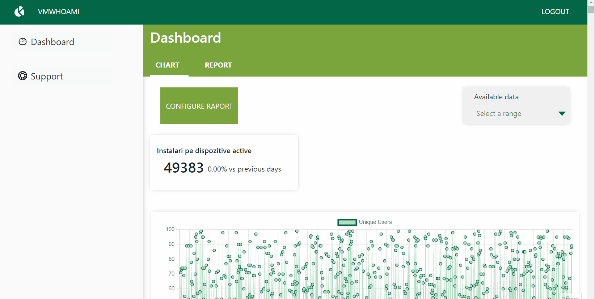

## Admin Ui Maib

### Requirements

- Must use the latest ReactJS.
- Mock web-service requests as needed. Assume API response delay ranging from 2ms to 15s.
- Use a favourite set of tools
- Best code practices.

- Selecting a period from the picker (upper-right portion) should re-populate the “card”, “chart” and “list” parts.
- Data should refresh automatically every 10s.

- UI should allow searching by 3 input fields.
- After a “search” button is pressed, list items should be re-populated with API response.



## Time estimate

A week with working 4 hours a day sometimes less some times more.

### Live Demo

Open [this link](https://maib-admin-test.netlify.app/) to view it live.

## Getting Started

To get a local copy up and running follow these simple example steps.

### Prerequisites

Make sure Node.js is running on your local machine

### Setup

```bash
$ git clone https://github.com/vmwhoami/admin_ui_maib
$ cd admin_ui_maib
```

Install modules:

```
npm install
```

Run the App:

```
npm start
```

## Available Scripts

In the project directory, you can run:

### `npm start`

Runs the app in the development mode.\
Open [http://localhost:3000](http://localhost:3000) to view it in the browser.

The page will reload if you make edits.\
You will also see any lint errors in the console.

### `npm test`

Launches the test runner in the interactive watch mode.\
See the section about [running tests](https://facebook.github.io/create-react-app/docs/running-tests) for more information.

### `npm run build`

Builds the app for production to the `build` folder.\
It correctly bundles React in production mode and optimizes the build for the best performance.

The build is minified and the filenames include the hashes.\
Your app is ready to be deployed!

See the section about [deployment](https://facebook.github.io/create-react-app/docs/deployment) for more information.

### Deployment

```bash
    git add .
    git commit -m "ready for the first push to Heroku"
    Heroku create $APP-NAME --buildpack mars/create-react-app
    git push Heroku $BRANCH_NAME: master
```

## Author

**Vitalie Melnic**

- Github: [@vmwhoami](https://github.com/vmwhoami/)
- Twitter: [@vmwhoami](https://twitter.com/vmwhoami)
- Linkedin: [vitalie-melnic](https://www.linkedin.com/in/vitalie-melnic/)

## License

Distributed under the MIT License. See `LICENSE` for more information.

## 🤝 Contributing

Contributions, issues and feature requests are welcome!

Feel free to check the [issues page](https://github.com/vmwhoami/catalogue-of-statisctics/issues).

## Show your support

Give a ⭐️ if you like this project!
